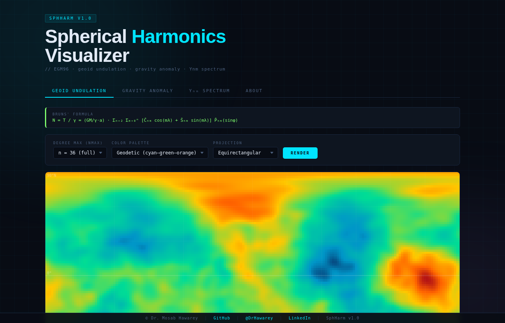

# SphHarm — Spherical Harmonics Visualizer

An interactive browser-based visualizer for Earth's gravity field using EGM96 spherical harmonic coefficients. Zero dependencies — pure HTML, CSS, and JavaScript.



## Features

| Tab | Description |
|---|---|
| **Geoid Undulation** | World map of N (metres) via Bruns' formula |
| **Gravity Anomaly** | Free-air gravity anomaly Δg (mGal) |
| **Yₙₘ Spectrum** | Interactive surface spherical harmonic Yₙₘ(φ,λ) renderer + degree variance spectrum |
| **About** | Model parameters, references, geodetic constants |

## Controls

- **nmax selector** — truncate the series at degree 6, 10, 20, or 36
- **Color palettes** — Geodetic, Polar, Jet, Viridis
- **Hover tooltip** — shows lat/lon and field value at cursor
- **Yₙₘ panel** — enter any n, m (0–20) and cosine/sine type

## Math

**Geoid undulation (Bruns' formula):**
```
N = T/γ = (GM/γa) · Σ_{n=2}^{nmax} Σ_{m=0}^{n} [C̄ₙₘ cos(mλ) + S̄ₙₘ sin(mλ)] P̄ₙₘ(sinφ)
```

**Free-air gravity anomaly:**
```
Δg = (GM/a²) · Σ_{n=2}^{nmax} (n−1) · Σ_{m=0}^{n} [C̄ₙₘ cos(mλ) + S̄ₙₘ sin(mλ)] P̄ₙₘ(sinφ)
```

**Fully normalized associated Legendre polynomials** via Holmes & Featherstone (2002) recurrence.

## Model

| Property | Value |
|---|---|
| Model | EGM96 (Lemoine et al. 1998) |
| Exact coefficients | n = 2–7 (NGA published values) |
| Extended (Kaula rule) | n = 8–36 |
| Reference ellipsoid | WGS84 (a = 6,378,137 m) |
| GM | 3.986004418 × 10¹⁴ m³/s² |
| Grid resolution | 2° × 2° (91 × 181 points) |

## Usage

### Local
```bash
# Must be served — not file:// (fetch() call for JSON)
python -m http.server 8080
# then open http://localhost:8080
```

## References

- Lemoine et al. (1998). *The Development of the Joint NASA GSFC and the NIMA Geopotential Model EGM96*. NASA/TP-1998-206861.
- Kaula, W.M. (1966). *Theory of Satellite Geodesy*. Blaisdell.
- Holmes & Featherstone (2002). A unified approach to the Clenshaw summation. *J. Geodesy* 76(5):279–299.

## Author

**Dr. Mosab Hawarey**
PhD, Geodetic & Photogrammetric Engineering (ITU) | MSc, Geomatics (Purdue) | MBA (Wales) | BSc, MSc (METU)

- GitHub: https://github.com/mhawarey
- Personal: https://hawarey.org/mosab
- ORCID: https://orcid.org/0000-0001-7846-951X

## License

MIT License.